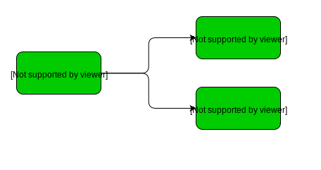
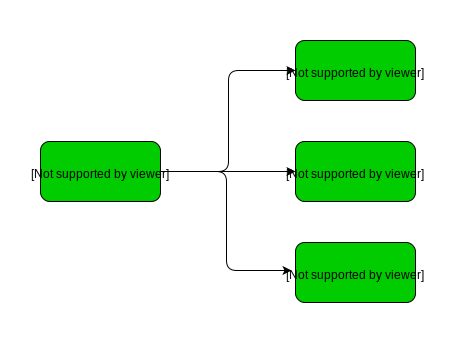
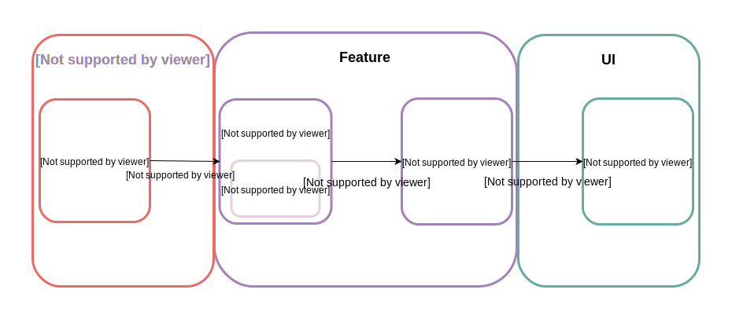

# MyTodoList

This simple Android project is a playground to explore and try architectures, libraries, language, in other word, build a modern Android project.
It consists in a simple TodoList application, with a TodoList screen (also with archived list), and an add / edit Todo screen.

It is written in **Kotlin**, and based on **Koin** for dependency injection. It relies on **databinding** and Architecture Component **ViewModel**
to implement a **MVVM** architecture.

An other important aspect of this project is modularisation. It aims at organizing the project with feature modules, improving 
flexibility to add / remove features, and enforce good separation of concern and decoupling.


### The App Module

The **App** module contains barely anything, only the **Application** class handling all application level initialization, such as
**Koin** or other libraries like **Stetho**. Therefore the manifest only declares the **application**. 

The app declares every feature module dependencies it intends to include. At least one of these modules needs to contain
a launcher activity. In our case, this is the **featuretodolist** module.




### The Feature Modules

**Feature** modules implement each a feature of the app, namely here the **Todo list**, and the **Add** and **Edit** screens. 
Implementing features in different modules helps to build an architecture with good separation of concern, since each feature
don't have any access to other feature codes. 

All code common to features is itself embedded in other modules, the **Code** and the **UI** modules in this project. 
Finally, since features are independent from each other, navigation is handled by a **Navigation** module.




### The Code Module

The **Core** module carries data models (**Todo** in our case), and exposes repository to manipulate these objects, from a database,
or possibly a server.


### The UI Module

The **UI** module embeds UI reusable components, widgets, utils and so on. It is totally separated from the core module and
therefore entity models, which ensures decoupling between logic and interface. It relies on **ViewModels** (from MVVM, not to
be mistaken with Architecture Components ViewModels) to pass data to be displayed to the UI (e.g. **CheckableCellViewModel**).


### The Navigation Module

The **Navigation** module handles navigation between features, since these don't have access to each other, being 
in separate modules. To achieve this, navigation relies on **DeepLinks**. The **NavigationHandler** builds Deep Link 
**Intents**, the target feature modules providing **path** and method to build **params**. 

**NavigationHandler** (navigation module): handles navigation to every feature. It relies on **FeatureNavigationHandlers**
for each feature.
```kotlin
interface NavigationHandler {

    fun buildTodoListIntent(context: Context): Intent

    fun buildAddTodoIntent(context: Context): Intent

    fun buildEditTodoIntent(context: Context, todoId: Long): Intent

}

class NavigationHandlerImpl(
        private val todoListNavigationHandler: TodoListNavigationHandler,
        private val addTodoNavigationHandler: AddTodoNavigationHandler,
        private val editTodoNavigationHandler: EditTodoNavigationHandler
): NavigationHandler {

    override fun buildTodoListIntent(context: Context): Intent {
        return buildIntent(
                todoListNavigationHandler.buildFeaturePath(context),
                todoListNavigationHandler.buildIntentParams(),
                context
        )
    }

    override fun buildAddTodoIntent(context: Context): Intent {
        return buildIntent(
                addTodoNavigationHandler.buildFeaturePath(context),
                addTodoNavigationHandler.buildIntentParams(),
                context
        )
    }
}  
```

**FeatureNavigationHandler** (navigation module): defines interface for specific **FeatureNavigationHandlers** to be implemented
and provided by feature modules. 
```kotlin
interface FeatureNavigationHandler {

    fun buildFeaturePath(context: Context, vararg parameters: Any): String

    fun buildIntentParams(vararg parameters: Any): Bundle? {
        return null
    }

}

interface TodoListNavigationHandler: FeatureNavigationHandler

interface AddTodoNavigationHandler: FeatureNavigationHandler
```

**TodoListNavigationHandlerImpl** (featuretodolist module): an example of **FeatureNavigationHandler** implementation, 
injected in **NavigationHandlerImpl**, that provides the path to build TodoList **DeepLink**.
```kotlin
class TodoListNavigationHandlerImpl: TodoListNavigationHandler {

    override fun buildFeaturePath(context: Context, vararg parameters: Any): String {
        return context.resources.getString(R.string.feature_path_todolist)
    }

}
```


### Global architecture

The architecture of the application is based on **MVVM**.
Let's take the TodoList feature. The architecture component **ViewModel** gets a **LiveData** of the **Todos** from the
**TodoRepository**. With the **TodoToCheckableCellViewModelTransformer** it transforms **Todos** to **CheckableCellViewModels**,
and provides a **LiveData** of **CheckableCellViewModels** to the **Activity**. The **Activity** observes this **LiveData**
and pass the **CheckableCellViewModels** to the **CheckableCellAdapter**.


This way, the **Core** module handles only business entities, with no knowledge to the UI. The **UI** module
on the other hand only handles views and has no knowledge of business entities. The **Feature** modules is just here to 
make the link between business entities and views. This architecture ensures reusabilitywith the **core** and 
**UI** modules, scalability with **feature** modules, and finally a good decoupling and separation of concern, each module
having a clear and single purpose.


