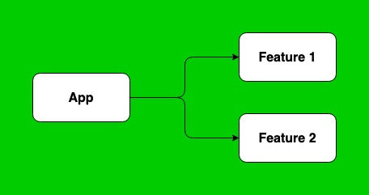
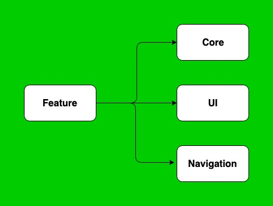

# MyTodoList

This simple Android project is a playground to explore and try architectures, libraries, language, in other word, build a modern Android project.
It consists in a simple TodoList application, with a TodoList screen (also with archived list), and an add / edit Todo screen.

It is written in **Kotlin**, and based on **Koin** for dependency injection. It relies on **databinding** and Architecture Component **ViewModel**
to implement a **MVVM** architecture.

An other important aspect of this project is modularisation. It aims at organizing the project with feature modules, improving 
flexibility to add / remove features, and enforce good separation of concern and decoupling.

### The App Module

The **App** module contains barely anything, only the **Application** class handling all application level initialization, such as
**Koin** or other libraries like **Stetho**. Therefore the manifest only declares the **application**. 

The app declares every feature module dependencies it intends to include. At least one of these modules needs to contain
a launcher activity. In our case, this is the **featuretodolist** module.

### The Feature Modules

**Feature** modules implement each a feature of the app, namely here the **Todo list**, and the **Add** and **Edit** screens. 
Implementing features in different modules helps to build an architecture with good separation of concern, since each feature
don't have any access to other feature codes. 

All code common to features is itself embedded in other modules, the **Code** and the **UI** modules in this project. 
Finally, since features are independent from each other, navigation is handled by a **Navigation** module.

### The Code Module

The **Core** module carry data models (**Todo** in our case), and exposes repository to manipulate these objects, from a database,
or possibly a server.

### The UI Module

TODO

### The Navigation Module

TODO

### Overall architecture

TODO